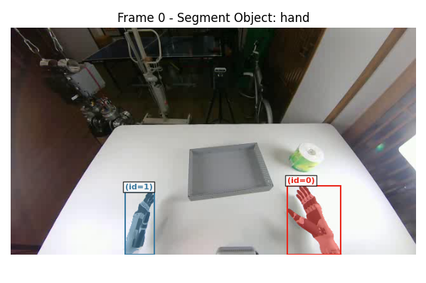
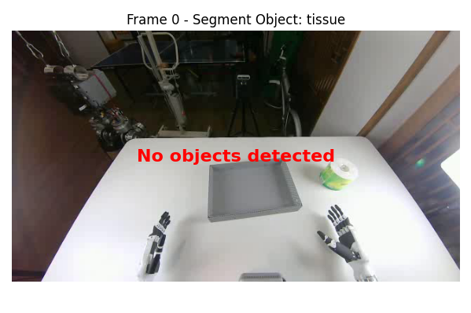
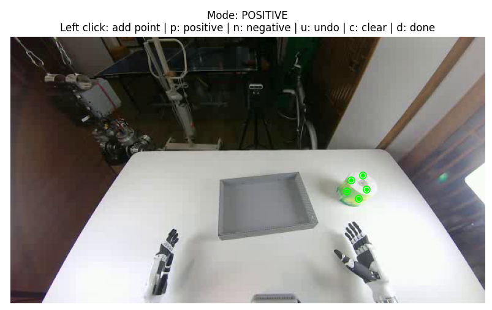
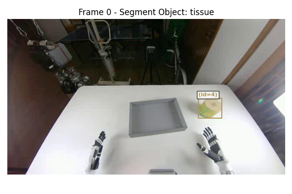

# SAM3 Text + Point Video Annotation & Rendering

This module describes the **text + point prompt annotation workflow** for video segmentation using **SAM3**.

It is designed for cases where **pure text prompt batch annotation produces suboptimal results**.
In those situations, **interactive point prompts** are used to refine the segmentation masks.

---

## Workflow Overview

The pipeline is similar to the **pure text prompt annotation workflow**:

1. Annotate video frames
2. Generate **COCO-format ground truth**
3. Render the annotated video

The difference is that **mask refinement is performed per instance using point prompts**.

> **Note:** Each object instance must be refined **individually**.

---

## Step 1 — Run the Text + Point Annotation Script

Configure the annotation settings in:

    ./annotate/config/profile.py

Use the same configuration as the **pure text prompt workflow**.

Run the annotation script:

```bash
python -m annotate.video_annotate_point s3c2
```

---

## Step 2 — Check Initial Annotation Quality

SAM3 annotates **each object instance separately**, therefore the refinement process is also performed **instance-by-instance**.

### Good segmentation example

<p align="center">
  
</p>

If the mask is correct:

    Press: y

SAM3 will proceed to the **next instance**.

---

### Poor or missing segmentation

<p align="center">
  
</p>

If the mask is incorrect or missing:

    Press: n

The system will enter **point prompt refinement mode**.

> **Important:**  
> For the **hand mask in cam2 view**, the mask must include **both hands**.

---

## Step 3 — Point Prompt Refinement

In this stage, a new window appears **without a mask**.

<p align="center">
  
</p>

You can refine the segmentation using **mouse clicks**.

### Positive Click (Add Region)

Add pixels to the object mask.

    Press: p
    Left-click: region to include

---

### Negative Click (Remove Region)

Remove pixels from the object mask.

    Press: n
    Left-click: region to exclude

---

After placing the desired point prompts:

    Press: d

SAM3 will generate a **refined mask** using the **text prompt + point prompts**.

---

## Step 4 — Verify the Refined Mask

SAM3 generates a refined mask in a new window.

<p align="center">
  
</p>

If the mask is correct:

    Press: y

If the mask still needs improvement:

    Press: r

This resets the mask and allows you to **redo the point prompt input**.

Repeat until the mask is satisfactory.

---

## Step 5 — Repeat for All Instances

Repeat **Step 2 → Step 4** for every instance in the frame.

After completing all instances:

- A **COCO-format ground truth file** will be generated.

---

## Step 6 — Render the Annotated Video

Run the rendering script to visualize the final annotations:

```bash
python -m annotate.video_render s3c2
```

This will generate the **rendered annotated video**.

<!-- --- -->

<!-- ## Keyboard Controls

| Key | Function |
|----|----|
| `y` | Accept current mask |
| `n` | Reject mask / enter refinement |
| `p` | Positive point mode |
| `n` | Negative point mode |
| `d` | Submit point prompts |
| `r` | Reset mask and redo | -->

---

## Notes

- SAM3 processes **each object independently**, so mask refinement must be performed **per instance**.
- Interactive point prompts allow **precise correction of segmentation errors**.
- The final output is automatically exported in **COCO annotation format**.
